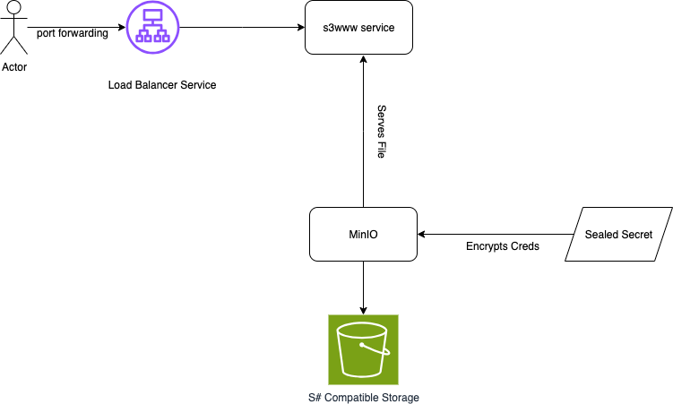
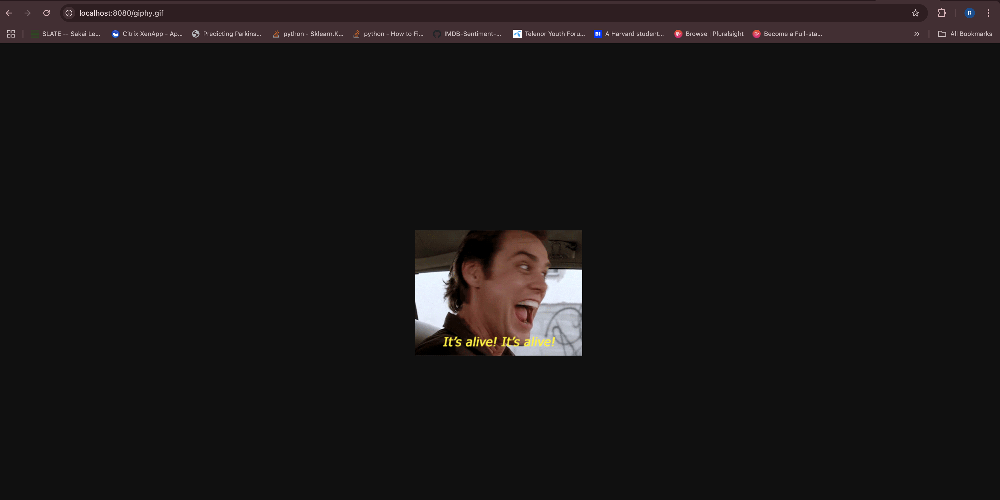
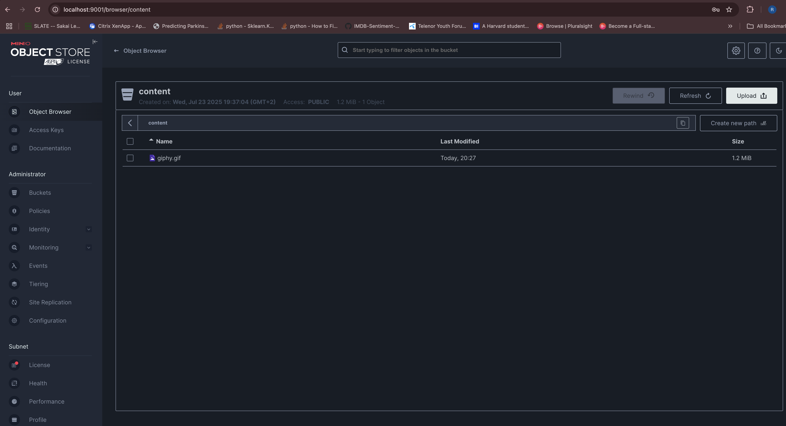
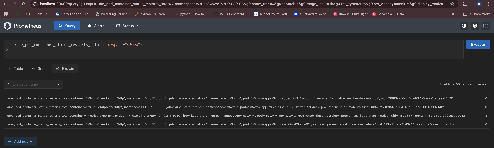

Senior Cloud Engineer - UP42 Assignment

## 📋 Table of Contents

- [Time Breakdown](#overview)
- [Architecture](#architecture)
- [Prerequisites](#prerequisites)
- [Deployment Steps](#deployment-steps)
- [Accessing the Application](#accessing-the-application)
- [Monitoring](#monitoring)
- [Cleanup](#cleanup)

## Time Breakdown

| Task                | Time Spent (hours) |    Comments
|---------------------|--------------------|-----------------|
| Planning            |     02h            |Didnt know about MinIO so had to understand the assignment in details
| Implementation      |     05h            |Implented Helm Charts, Terraform, Sealed Secrets for increased Security, Modularization of terraform resources.
| Testing             |     01h            |Steps mentioned below
| Documentation       |     01h            |
| Review & Cleanup    |      -             |
| **Total**           |     09h            |


## Architectural Diagram



## Prerequisites

Before starting, ensure you have the following installed:

- **Docker Desktop** with Kubernetes enabled
- **kubectl** (v1.21+)
- **Helm** (v3.8+)
- **Terraform** (v1.0+)
- **kubeseal** (v0.30.0)


## Deployment Steps

### Step 1: Validate Helm Chart

```bash
helm repo add minio https://charts.min.io/ ## I used minio as a dependency chart for s3www, but I did provide custom values.yml for customised credentials and standalone version
helm repo update

cd helm-charts/s3www-app
helm dependency update
```
### Step 2: Initialize Terraform

```bash
# In the root directory, ran these commands to initialize, plan and apply resources.
terraform init

terraform validate

terraform fmt -recursive

```

### Step 3: Plan Deployment

Before applying the whole terraform, we first need to make sure that we have sealed secrets helm release ready and we can excrypt the secrets easily, for that I simply ran terraform apply command specifically for sealed-secret resource.

```bash
terraform apply -target="module.sealed_secrets"
```
This made sure that sealed secret with all CRDs is available in the kube-system namespace, Please note that we have to do this step just once at the cluster creation, then we can use this for generating all secrets easily.  
After than, I created a simple yaml file will my desired credentials, but I didnt commit this file in repo as this will not be needed anymore.

```yaml
apiVersion: v1
kind: Secret
metadata:
  name: s3www-app-minio
  namespace: s3www
  annotations:
    sealedsecrets.bitnami.com/managed: "true"
type: Opaque
stringData:
  rootUser: admin
  rootPassword: password123
```
and then ran the following command

```bash
kubeseal \                                  
  --format yaml \
  --cert <(kubeseal --fetch-cert --controller-namespace kube-system --controller-name sealed-secrets) \
  < .tmp/temp-secrets.yml > sealed-secret.yaml
```
This gave me a sealed-secret.yaml file, which I used in sealed-secret.tf file to create an actual secret which is then referenced in values.yml of s3www helm chart (line 130), hence securing the credentials
The benefit of this approach is that we can commit secrets in github without being exposed and only sealed secret inside cluster can decrypt it and fetch the actual value.  

You can read more about sealed-secrets here (https://github.com/bitnami-labs/sealed-secrets) for reference, also I can explain if needed.  


Once I have secrets populated in terraform code, I can deploy the whole terraform as below.
```bash
terraform plan -var-file="environments/dev.tfvars" -out=devplan
```
Note that I used dev.tfvars for development environment, we can use other files in environment folder as per needed for different envs.  


### Step 4: Deploy Infrastructure

```bash
terraform apply devplan. ##Ofcourse after careful review
```

### Step 5: Verify Deployment

```bash
# Check namespace and pods
kubectl get pods -n s3www

# Check services
kubectl get services -n s3www

# Check Helm release
helm list -n s3www
```

## Accessing the Application

I used port forwarding method since I am using docker desktop and didnt deploy nginx ingress controller or any other ingress controller. Since my service is of type LoadBalancer, I can port forward it to test the functionality.

```bash
# Access s3www application
kubectl port-forward -n s3www svc/s3www-app-s3www 8080:8080
```


```bash
# In another terminal, access MinIO console
kubectl port-forward -n s3www svc/s3www-app-minio-console 9001:9001

# Access URLs:
# - s3www: http://localhost:8080
# - MinIO Console: http://localhost:9001  (Get decrypted credentials as described in output.tf)
```



## Monitoring

Regarding monitoring, I deployed a test prometheus stack in my cluster and exposed the cluster level metrics to it using 'kube-state-metrics', I also configured s3www app to send the metrics to prometheus but as of now we dont have any endpoint where we can setup node exporter to fetch metrics from. Once the metrics are available, the operator configured will fetch and add a target in prometheus through which we can query the metrics.

```yaml
{{- if .Values.s3www.monitoring.enabled }}
    prometheus.io/scrape: "true"
    prometheus.io/path: {{ .Values.s3www.monitoring.path | quote }}
    prometheus.io/port: {{ .Values.s3www.monitoring.port | quote }}
{{- end }}
```

Just for the sake of visibility, adding the screenshot which shows prometheus exporting deployment metadata metrics using kube-state-metrics



## Cleanup

```bash
terraform destroy -var-file="environments/dev.tfvars" -auto-approve

rm -rf .terraform terraform.tfstate terraform.tfstate.backup tfplan .terraform.lock.hcl
```
To delete namespace and helm release

```bash
helm uninstall s3www-app -n s3www

kubectl delete namespace s3www
```
